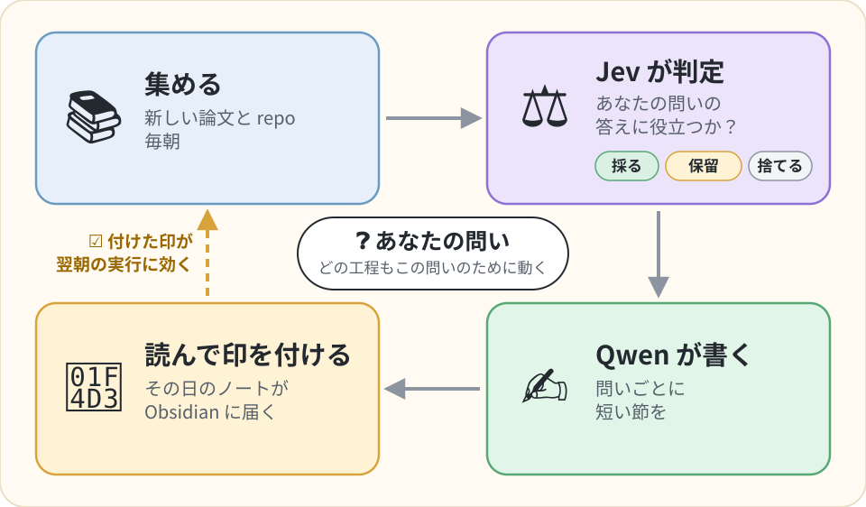

# jev-research-pipeline

[English](README.md) | **日本語**

**立てた問いを毎朝追いかける、リサーチの見張り番です。ループはコードが回し、判定は判定専用モデルの Jev、文章は Qwen が受け持ちます。**

[](LICENSE)
[](pyproject.toml)
[](docs/pilot-log.md)

<p align="center">
  
</p>

jev-research-pipeline は、1 人で使うリサーチ用のパイプラインです。研究テーマごとに、まだ答えの出ていない問いをいくつか立てておきます。すると毎朝、新しい論文とリポジトリをその問いに照らして確かめ、テーマごとに 1 枚のノートを Obsidian の vault に書きます。ノートには、その日に動きのあった問いごとの節が並びます。ループは、毎回同じ手順で動く Python のコードが回します。各資料が問いの答えに役立つかを決めるのは、API 企業 TypeSafe の判定モデル Jev です。Jev は文章を書かず、答えの決まった質問（Yes/No、点数、一覧から 1 つ選ぶ質問）に確率で答えます。Alibaba Cloud の DashScope で動く LLM の Qwen は、本文だけを書きます。ノートのチェックボックスに印を付けるとループが閉じ、その印が次の実行に効きます。

まだ試験運用（pilot）の段階で、作者が毎日使っています。Python 3.12 と、有料の API key が 2 つ（Jev 用の TypeSafe と、Qwen 用の DashScope）必要です。定期実行には macOS の launchd を使います（手動の実行は、Python 3.12 が動く環境ならどこでもできます）。ライセンスは MIT です。ノートは今のところ日本語で書かれます。本文への指示と節見出しがソースに日本語の文字列で入っていて、言語の切り替えはまだありません。

これを作ったのは、前の仕組みの [daily-research](https://github.com/shimo4228/daily-research) では、Web 検索ができる Opus の agent に、Claude Code の非対話モード `claude -p` でループ全体を任せていたからです。研究テーマ 3〜4 本で 1 日あたり $8〜15 の利用額が報告され、agent は同じ主題に戻り続けました。agent がこれまでに選んだ調査題目 238 件のうち、88 件（37%）が同じ 1 つの主題でした。ここでは、判定はすべて答えの決まった安い質問で、一つひとつをコードが確かめられます。どこを探すかを、モデルが決めることもありません。研究テーマ 4 本の朝の費用は、ノート自身の費用欄で $1〜2 です（[現状](#現状2026-09-25-時点)を見てください）。経緯の全体は記事「[LLMに任せていたリサーチの判定を、判定専用モデルJevに移す](https://zenn.dev/shimo4228/articles/jev-research-judgment-offload)」（[英語版](https://dev.to/shimo4228/moving-my-research-pipelines-judgment-calls-from-an-llm-to-jev-a-judgment-only-model-4ncj)）に書きました。Jev を使ったほかの実験と、このパイプラインが見張っているプロジェクトは「[著者のほかの仕事](#著者のほかの仕事)」にあります。

## 毎朝の実行の流れ

研究テーマ 1 つを、ここでは「ライン」と呼びます。固有の語彙を持つ、長期の研究テーマです。毎朝、次のように動きます。

1. そのラインの過去のノートから、あなたが付けた印を取り込みます。
2. 輪番で次の 3 ラインと、毎日走るラインを選びます。
3. 未解決の問いごとに、固定された 5 本の探索経路（[探索の網](#探索の網)）から候補を集めます。
4. Jev が (資料, 問い) の組を 1 つずつふるいにかけます。まず安い「話題に合うか」の確認、次に Yes/No の関門と、重み付きの採点です。閾値を当てるのはコードで、組を Keep（採る）、Review（保留。境界のもの）、Drop（捨てる）、Incomplete（判定できる要旨が無い）、Unjudged（Jev への問い合わせが失敗した）に振り分けます。
5. Keep になった資料は原文の文に切り分けられ、どの文が問いを前に進めるか、あるいは問いに反するかを Jev が見分けます。こうして選び出した文を claim と呼びます。claim は常に原文の 1 文で、言い換えではないので、引用は必ずたどれます。
6. Qwen が、今日新しい証拠が出た問いごとに短い節を書きます。材料はそれらの claim と出典の短い抜粋で、推論の段落を 1 つだけ明示します。Qwen は自分の下書きを 1 回点検し、そのあと Jev が節を採点基準（rubric）で採点し、証拠の段落が claim と合っているかを 1 段落ずつ確かめます。通らなかった下書きは 1 回だけ書き直し、それでも通らなければテンプレートに戻します。
7. ノートを運用節つきで vault に書きます。運用節には、Jev への質問数、トークン数、費用、網ごとの採用率、canary の結果（その問いなら必ず残すべき論文が残ったか）が並びます。

あなたが付ける印が、そのままラベルになります。推薦の網（印を付けた論文に近い論文を探す網）の種になり、`jrp fit` が書く閾値の見直し案（適用するのはあなたです）に効き、評価用のケースにもなります。Jev の呼び出しはすべて Pydantic AI の `typesafe:` モデルを通るので、判定はどれも Pydantic の出力型で、確率分布の生の値も判定と一緒に保存されます。

## 現状（2026-09-25 時点）

- **評価のための実行は 11 回で、2026-09-23 に終えました。** 最後の回は、7 つの目標条件のうち 5 つを満たしました。どのノートも 12 KB 未満で Review の一覧が短い、証拠のある問いにはすべて本文がある、話題外の論文は捨てて canary はすべて残した（canary とは、その問いなら必ず残すべき論文やリポジトリのことです。[中心にあるのは問い](#中心にあるのは問い)を見てください）、その回は資料 API の取得失敗がなかった、stack trace がない、の 5 つです。時間と費用の条件は、時間だけで落ちました。上限 600 秒に対して 601 秒です（費用は上限 $0.30 に対して $0.297）。もう 1 つ、独立した判定者（完成したノートだけを 7 軸の採点基準で読む、別の Opus）が、3 本中 1 本しか公開できると判定しませんでした。1 回ごとの記録は [docs/pilot-log.md](docs/pilot-log.md)（英語）にあります。
- **評価のあと、本文を書く工程を作り直しました。** 何をなぜ変えたかは「[なぜ生成でなく判定なのか](#なぜ生成でなく判定なのか)」にあります。過去の実行から凍結した入力で試したところ、私は 6 件すべてを読みやすいと感じ、忠実さの検査（下書きを出典と照らし合わせる別のモデル）は 5 件を通しました（[docs/design/pipeline-design.md](docs/design/pipeline-design.md)、英語）。
- **2026-09-24 からは毎朝動いています。** launchd が毎朝、本物の vault に対して、私の 7 つのラインを回します。新しい本文の工程のぶん、費用は評価の最後の回（同じく 4 ラインで $0.297）より上がり、最初の 2 日は $1.05 と $1.75、所要時間は約 15 分でした。この 2 日のノートは、まだ独立した Opus の判定者に読ませていません。また、これまでの 2 回の毎朝の実行では、arXiv のキーワード検索が HTTP 406 を返したので、`arxiv:` の検索語は何も持ってきませんでした（arXiv の新着は firehose の網から届いています）。OpenAlex の引用検索も一部が失敗しました。OpenAlex の失敗は 2026-09-25 に直しました。arXiv については、リトライしても 406 が続いたら、その日のキーワード検索を打ち切るようにして、ラインごとにリトライを繰り返さないようにしました。
- **閾値。** Jev の振り分けの閾値は、TypeSafe が公開している例（cookbook）の値から始めて、評価の間に手で調整しました。印からの再推定はまだしていないので、境界の判定は出てきます。それが各ノートの Review に並び、そこに付けた印が、再推定の材料になります。

## はじめかた

- Python 3.12 と [uv](https://docs.astral.sh/uv/)。
- TypeSafe の API key（[docs.typesafe.ai](https://docs.typesafe.ai)）と、DashScope の API key（Alibaba Cloud Model Studio）。
- 実行に要る環境変数（path と key）は `~/.config/jrp/env` の 1 ファイルに書きます。ラインと網の予算は `config.toml` に、問いはリポジトリの `questions/` ディレクトリに置きます。定期実行では `scripts/launchd-jrp.sh` がこの env ファイルを読みます。手動で実行するときは、先に `set -a; source ~/.config/jrp/env; set +a` を実行します。

最小の `~/.config/jrp/env`:

```bash
export JRP_VAULT_DIR="/path/to/your/obsidian/vault"     # ノートは <vault>/daily-research/ に書かれる
export JRP_STORE_DIR="/path/to/store"                   # パイプラインの状態。ライン 1 本に JSON-LD 1 ファイル
export TYPESAFE_API_KEY="..."
export DASHSCOPE_API_KEY="..."
export JRP_COST_CAP_USD="0.50"                          # 1 回の実行の、ライン 1 本あたりの上限
export JRP_DAILY_RESEARCH_CONFIG="/path/to/config.toml" # ラインの一覧
```

`config.toml` にラインを並べます。ライン 1 本が `[tracks.<slug>]` の表 1 つです（「track」と「line」は同じ意味です）。ラインは研究用のリポジトリを前提に設計しています。輪番に入るのは、`[[tracks.<slug>.repos]]` の項目と `target_repo` でリポジトリを指しているラインだけで、そのリポジトリから読むのは `graph.jsonld` だけです。`graph.jsonld` があれば、その中の `Concept` と `DefinedTerm`（schema.org の型）のノード名がラインの語彙になり、Jev のふるい分けと本文で使われます。無ければ、ラインの名前だけが語彙になります。リポジトリの無いテーマは、`daily = true` のラインにすれば、輪番とは別に毎朝走ります。

```toml
[general]
lines_per_day = 3

[tracks.akc]
name = "Agent Knowledge Cycle"
[[tracks.akc.repos]]
target_repo = "~/projects/agent-knowledge-cycle"   # 輪番に必要。読むのは graph.jsonld だけ

[tracks.jev]
name = "TypeSafe Jev"
daily = true                                       # 輪番のラインと並んで毎朝走る
```

ラインごとに未解決の問いを 1 つ以上書いてから（次の節）、次を実行します。

```bash
uv sync
uv run jrp run                # 印を取り込み、次のラインを走らせ、ノートを書く
```

未解決の問いが 1 つも無いラインは飛ばされ、そのことが報告されます。印が溜まったら、`jrp fit` が閾値の再推定案を出し（提案ファイルを書くだけで、適用はしません）、`jrp export-cases` が印の付いた claim を pydantic-evals のケースに変えます。保守用のコマンドは `uv run jrp --help` で一覧できます。すべての変数と `config.toml` の全体は [docs/configuration.md](docs/configuration.md)（英語）にあります。

## 中心にあるのは問い

ライン 1 本につき、リポジトリの `questions/<slug>.md`（または `JRP_QUESTIONS_DIR` が指す場所）に 1 ファイルです。問いの出来が、実行で見つけられるものの上限を決めます。実際の `questions/jev.md` から一部を抜いた例です。

```markdown
<!-- jrp:questions:jev -->

## Jev（判定モデル）はどこで失敗するか — 較正の崩れ、LLM に戻された判断、framework 統合で落ちた表現力
- slug: jev-failure-modes
- version: 1
- status: open
- opened: 2026-09-23
- retire: TypeSafe が失敗条件を版ごとに公開し、第三者の再現が揃ったら answered
- brief: 確率出力が崩れる条件（分布外、答えの無い問い、質問の型）、LLM から Jev に置き換えて戻した事例とその理由、pydantic-ai 等の統合で失われるもの
- method: 公開 repo の再現実験（較正・ECE・一致率）
- evidence: 数値か、失敗を再現できるコードがあるもの
- not: Jev を使ってみた感想だけの投稿
- canary: https://github.com/scienthoon/jev-ood-calibration
- arxiv: jev system one
- github: jev calibration
- hf: judge model calibration
- web: TypeSafe Jev calibration failure
```

パーサーはすべての欄を読みます。`slug` と `version` が問いを識別します。文面を変えたら version を上げてください。上げないと、前の文面で下した判定が、新しい文面の判定として数えられます。`status` は実行するかどうかを決めます（`open` / `answered` / `dropped`。未解決の問いは `open` です）。`brief`、`method`、`evidence` は、Jev が (資料, 問い) の組ごとに見る状態に入ります。`not:` の行は、隣り合っていて放っておくと毎日通ってしまう話題を、関門に教えます。Jev のためでなく、あなたのための欄が 2 つあります。`opened` は問いを立てた日で、`retire:` は問いを閉じる条件を前もって書いておくものです。

`canary:` の行には、この問いなら必ず残すべき論文やリポジトリを書きます。その日どの網もそれを持ってこなければ、URL から取りにいって、同じようにふるいにかけます。canary が落とされると、ノートの運用節に出ます。ふるい分けがずれた合図です。

`arxiv:`、`github:`、`hf:`、`web:` の行は、この問いのためのキーワード網の検索語で、1 行に 1 つ書きます。英語で書きますが、`web:` の検索語は日本語でもかまいません。検索語は問いと一緒に、自分で書くか、自分のセッションでアシスタントに下書きさせ、実行に使う前に試します。`uv run jrp queries check --line <slug>` が各検索語を 1 回ずつ投げ、件数と最新のタイトルを表示します（何も保存しません）。arXiv はすべての語に一致するものを探す（`all:w1 AND all:w2`）ので、arXiv の検索語は 2〜4 語に収めてください。検索語の行が無い問いはキーワード検索を送りません（ノートの運用節にそう出ます）。ほかの網は、その問いのためにも走ります。書き方の手順は [AGENTS.md](AGENTS.md)（coding agent 向けの作業手順）にあります。

実行中にこのファイルが書き換わることはありません。問いと検索語が変わるのは、あなたが変えたときだけです。

## ノートの見た目

見出しと本文は日本語で、構成は次のとおりです。

```
# <ライン> — <日付>
### <問い>                      今日新しい証拠が出た問いだけが節になる
今日の変化                      本文。[n] は claim の番号。推論と印した段落だけが推論
証拠                            この問いの今日の資料
反証                            答えに反する claim（あれば）
- [ ] 読む価値があった            問い × 日に 1 つ。印は引用した claim にも伝わる
## Review                       境界の資料。最大 10 件、1 件に 1 つのチェックボックス
## 橋渡し                         ラインの語彙の外にあるものと問いをつなぐ、と Jev が判定した資料
> [!note]- Claims               畳まれた claim の一覧。出典とチェックボックスつき
## 未判定                         Jev への問い合わせが失敗した組
## 運用                          運用節
```

印は次の実行で読み戻されます。`[x]` は「はい」（読む価値があった、正しい）、`[-]` は「いいえ」、`[ ]` は印なしです。Obsidian でクリックすると `[x]` になります。`[-]` は手で入力してください。

## 探索の網

どこを探すかを agent 自身に任せると、探索は同じところに集まります（冒頭の 37%）。そこで、どの網をどの順で走らせ、それぞれが何回問い合わせてよいかは、コードが固定します。実行中にモデルが検索語を書くことはありません。キーワード網は問いのファイルに書いた検索語を送り、推薦の網と引用の網は、Jev のふるい分けが残した論文を種にします。モデルが網を足したり、飛ばしたり、順番を変えたりすることもありません。

| 網 | 何を取ってくるか | 既定の予算（1 回の実行での API 呼び出し数） |
|---|---|---|
| firehose | 固定したカテゴリの arXiv 新着と Hugging Face の daily papers。検索語なし | 2 |
| recommendation（推薦） | 印を付けた論文と Keep の論文を種にした Semantic Scholar の推薦（乱択の負例つき） | 1 |
| citation（引用） | Keep の論文を引用した論文（OpenAlex） | 3 |
| keyword（キーワード） | 問いごとに書いた検索語を、arXiv（1 回）、Hugging Face papers、GitHub、key があれば Tavily の Web 検索に送る | 10。設定の 12 から、exploration 用に 20%（2）を取り分けた残り |
| exploration（探索） | Keep の論文に隣り合う OpenAlex の topic。store に OpenAlex の論文が入るまでは何もしない | 1。取り分けた 2 のうち 1（残りは使わない） |

資料側の API key が無くても、どの網も動きます（TypeSafe と DashScope の key は常に要ります）。例外はキーワード網の中の 1 つで、`TAVILY_API_KEY` が無ければ Tavily の Web 検索は飛ばされ、ノートにそう書かれます。Semantic Scholar、OpenAlex、GitHub には key なしの共有枠があり、key を入れると上限が上がります。予算、exploration に回す割合、arXiv のカテゴリ、OpenAlex の 1 日の credit 上限は、`config.toml` の `[nets]` で変えられます。運用節には網ごとの採用率と、Keep の論文に含まれる OpenAlex の topic の種類数が出ます。topic の数が減っていくのは、探索が集まり始めた警報です。

## なぜ生成でなく判定なのか

設計の賭けは、agent のループが LLM にさせていることの大半は判定で、判定なら、答えの決まった質問として、較正された確率を返すモデルに聞ける、というものです。評価で分かった 3 つのことが、今の形を決めました。

- 判定の基準になる問いが無いと、Jev の関連度の判定は、ラインと言葉を 1 つでも共有するものをほとんど通しました。瞑想と無我についてのラインが、transformer の attention についての claim で埋まったほどです。すべての判定を (資料, 問い) の組に結び付けたことで、これは直りました。
- ふるい分けを段階に分ける前の実行では、1 ラインに Jev への質問が 20,573 問、ノートは 283 KB になりました。まず各資料を問いに照らしてふるい（安い「話題に合うか」の確認のあとに本番の判定）、claim は Keep の資料からだけ切り出すようにしたことで、1 ラインの質問はおよそ 900〜1,900 問、ノートは 12 KB 未満になりました。
- 難しいのは本文です。評価の間、独立した判定者が公開できると判定したのは多くても 3 本中 1 本で、よくある失敗は、論文の主張を問いの言い回しに合わせて曲げることでした。そこで本文の工程を作り直しました。新しいプロンプトとモデル qwen3.7-max、原文の claim と並べて渡す出典の短い抜粋、下書きの自己点検、そしてノートを書く前に、証拠の段落が claim と合っているかを Jev が 1 段落ずつ確かめることです。

すべての判断と、その根拠にした外部の証拠を含む設計の記録は [docs/design/pipeline-design.md](docs/design/pipeline-design.md)（英語）にあります。

## 観測・定期実行・開発

トレースは OpenTelemetry です。`OTEL_EXPORTER_OTLP_ENDPOINT` が未設定なら SDK は初期化されず、span はすべて何もしません。定期実行はトレースを送りません。endpoint は、デバッグしている実行のコマンドラインにだけ付けてください。Docker の要らないローカルの viewer、そのコマンドライン、span の名前は [docs/observability.md](docs/observability.md)（英語）にあります。

launchd の plist は [launchd/](launchd/README.md) に 2 つあります。`jrp run` を毎日 05:00 に、`jrp drift`（Jev の確率がずれていないかを、記録した入力を投げ直して確かめる）を毎週月曜 05:30 に走らせます。読み込む前に、絶対 path を自分の環境に合わせて直してください。vault が iCloud Drive にある場合、wrapper はノートを `<JRP_STORE_DIR>/vault-stage/` 経由でコピーします。macOS は、launchd の bash には iCloud のファイルを開かせますが、uv が管理する Python には開かせないからです。

```bash
.claude/verify.sh     # format、lint、型、bandit、deptry、テスト。offline で key 不要
uv run pytest -q      # 記録済みの cassette を再生する。実際の API を使う記録は明示したときだけ（docs/configuration.md）
```

## 関連

- [TypeSafe Jev](https://docs.typesafe.ai) と [Pydantic AI の `typesafe:` モデル](https://pydantic.dev/docs/ai/models/typesafe/)
- [DashScope の Qwen](https://www.alibabacloud.com/help/en/model-studio/models)

## 著者のほかの仕事

Jev を使った実験は、どれも記事にしています（日本語は Zenn、英語は Dev.to）。

- 「[文章を書かないモデルJevのスキル選択は、0.3秒でOpusにどこまで近づくか](https://zenn.dev/shimo4228/articles/jev-vs-opus-skill-selection)」（[英語版](https://dev.to/shimo4228/how-close-to-opus-does-jev-a-model-that-writes-no-text-get-at-skill-selection-in-03-seconds-1nfj)）。同じ 150 件の状況で、Jev と Claude Opus に skill を選ばせて比べました。Jev と Opus の一致は、Opus 同士の一致の約半分で、費用は約 560 分の 1 でした。
- 「[Jevの判断をローカルで再現するには何が要るか](https://zenn.dev/shimo4228/articles/local-decision-model-conditions)」（[英語版](https://dev.to/shimo4228/what-does-it-take-to-reproduce-jevs-decisions-locally-3i0n)）。手元で動く 4 つのモデルに同じ 150 件を解かせ、4 つとも、それぞれ別の理由で届きませんでした。
- 「[JevのスキルルーターをClaude Codeに足して、スキル一覧を書き換える手前で引き返した](https://zenn.dev/shimo4228/articles/jev-retrofit-limits)」（[英語版](https://dev.to/shimo4228/i-added-jevs-skill-router-to-claude-code-and-turned-back-just-before-rewriting-the-skill-listing-34in)）と、そのコードの [jev-skill-router](https://github.com/shimo4228/jev-skill-router)。どのインストール済みの skill がプロンプトに合うかを Jev に尋ねる Claude Code の hook です。動かした結果、強いモデルの助けにはなりにくいと分かりました。

このパイプラインが見張っているラインは、私自身の長期のプロジェクトです。たとえば、エージェントと運用者の意図が、どちらも変わっていくなかでずれないようにするループの [Agent Knowledge Cycle](https://github.com/shimo4228/agent-knowledge-cycle)、エージェントが失敗したとき誰が責任を持つかを決める記録の [Agent Attribution Practice](https://github.com/shimo4228/agent-attribution-practice)、読者が LLM を通してアイデアに出会う時代に、著者の名前を残す方法を扱う [Authorship Strategy](https://github.com/shimo4228/authorship-strategy) があります。これらを含むすべてのプロジェクトと新しい実験は、[github.com/shimo4228](https://github.com/shimo4228) からたどれます。記事の一覧は [Zenn](https://zenn.dev/shimo4228)（日本語）と [Dev.to](https://dev.to/shimo4228)（英語）にあります。
