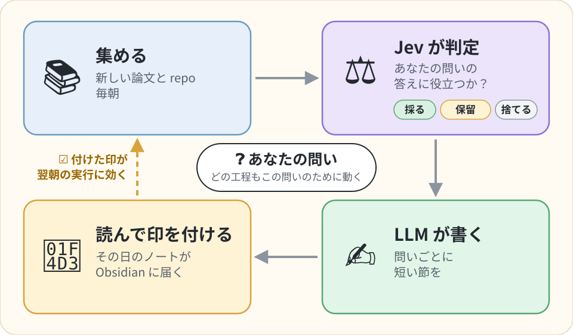

# jrp — jev-research-pipeline

[English](README.md) | **日本語**

**追いかけているテーマについて、毎朝リサーチのノートを。探す先は立てた問いが決め、何が効くかは判定専用モデルの Jev が決め、説明は選んだ LLM が英語・中国語・日本語で書きます。**

[](LICENSE)
[](pyproject.toml)
[](docs/pilot-log.md)

<p align="center">
  
</p>

jrp は、1 人でリサーチを追いかけるためのコマンドラインのパイプラインです。テーマ（ここでは「ライン」と呼びます）ごとに、まだ答えの出ていない問いを 2〜4 本立てておきます。すると jrp は毎朝、ラインを輪番で選び（既定は 1 朝 3 ライン）、新しい論文とリポジトリをその問いに照らして確かめ、ラインごとに 1 枚の Markdown のノートをフォルダ（ふつうは Obsidian の vault）に書きます。ノートには、その日に動きのあった問いごとの節が並びます。ループは、毎回同じ手順で動く Python のコードが回します。各資料が問いの答えに役立つかを決めるのは、API 企業 TypeSafe の判定モデル Jev です。Jev は文章を書かず、答えの決まった質問（Yes/No、点数、一覧から 1 つ選ぶ質問）に確率で答えます。説明の文章だけは汎用の LLM が書きます。ノートのチェックボックスに印を付けるとループが閉じ、その印が次の実行に効きます。

まだ試験運用（pilot）の段階で、私が 2026-09-24 から毎朝動かしています。ライセンスは MIT で、Python 3.12 が要ります。macOS（launchd で定期実行）と Linux（cron か systemd）で動きます。

## 必要なもの

Python 3.12 と [uv](https://docs.astral.sh/uv/) のほかに、省けないアカウントが 2 つあります。

- **Jev 用の TypeSafe の有料 API key**（[docs.typesafe.ai](https://docs.typesafe.ai)）。Jev がこの設計の中心で、ループの判定はすべて Jev への質問です。
- **本文の書き手を 1 つ**。次のどれかです。

| 書き手 | `JRP_PROSE_MODEL` | 要るもの |
|---|---|---|
| ChatGPT のサブスクリプション（既定） | `openai-codex:gpt-6-luna` | Codex を含む ChatGPT のプランと、1 回の `jrp codex login` |
| Claude のサブスクリプション | `claude-code:claude-opus-5-5` | ログイン済みの Claude Code CLI（`claude auth login`） |
| Qwen（従量課金） | `dashscope:qwen3.7-max` | `DASHSCOPE_API_KEY`（Alibaba Cloud Model Studio） |

ほかは任意です。資料側の API key を入れると無料枠が広がり、`TAVILY_API_KEY` を入れると Web 検索が加わります。

## はじめかた

```bash
uv tool install jrp
jrp init --lang ja              # ~/.config/jrp/ に env、config.toml、questions/agent-memory.md を書く
```

`~/.config/jrp/env` を開いて、`JRP_VAULT_DIR`（ノートの置き場）と `TYPESAFE_API_KEY` を埋め、`JRP_PROSE_MODEL` で書き手を選びます。それから設定を確かめ、その場でノートを 1 枚作ります。

```bash
set -a; source ~/.config/jrp/env; set +a
jrp doctor                      # 実行に要るものを、実行せずにすべて確かめる
jrp try --line agent-memory     # 使い捨てのフォルダに 1 回だけ回し、ノートの path を出す
```

`jrp init` はすでにあるファイルには触れません。`jrp try` は vault にも store（jrp が過去の資料と判定を残す記録。ライン 1 本に JSON-LD 1 ファイル）にも書きません。毎朝走らせるときは、次を実行します。

```bash
jrp schedule install --hour 5   # macOS: launchd の job を書き、読み込み方を表示する
```

Linux の cron と systemd の例は [docs/scheduling.md](docs/scheduling.md)（英語）にあります。通知は Slack の webhook、macOS の通知センター、またはその両方に送れます（同じページ）。すべての環境変数と `config.toml` の全体は [docs/configuration.md](docs/configuration.md)（英語）にあります。インストールせずに試すときは、各 `jrp` コマンドの前に `uvx` を付けます（`uvx jrp init --lang ja`）。

## ノートの見本

同じラインと同じ問いを、同じ朝に、書き手を Claude Opus にして各言語で回したものです: [英語](docs/samples/agent-memory.en.md) · [中国語](docs/samples/agent-memory.zh.md) · [日本語](docs/samples/agent-memory.ja.md)。見本からは第三者の文を省き、claim（jrp が出典から引く原文の 1 文）と出典の横の抜粋はリンクに置き換えました。本文と運用節（ノートの最後のブロック。質問数、費用、検索ごとの取得数）は jrp 自身の出力です。

## 費用

私の環境で、ノート自身の運用節から測った値です（2026-09-24〜10-01）。

| | ライン 1 本の 1 回（問い 3 本） | 1 朝（4 ライン） |
|---|---|---|
| Jev への質問数 | 200〜2,600 | 2,470〜8,191 |
| Jev の費用（1 問 $0.00002 のとき） | $0.004〜0.05 | $0.05〜0.16 |
| 書いた本文の節 | 0〜3（動いた問いごとに 1 つ） | 5〜8 |

1 つの節には、書き手の下書き 1 回と自己点検 1 回がかかります。`openai-codex:gpt-6-luna` で入力およそ 8,000〜12,000、出力 1,500〜4,000 トークン、`claude-code:claude-opus-5-5` で入力およそ 11,000、出力 5,000 トークンです。落ちた下書きはもう 1 回書き直します。サブスクリプションの書き手では、これはドルではなくプランの利用量に数えられます。DashScope では、モデルのトークン単価を掛けてください。$0.00002 は、私が費用欄のために env に設定した Jev の単価です。TypeSafe の今の料金を確かめてください。資料の検索は、key が無ければ費用はかかりません。OpenAlex の 1 日の無料枠は、全ラインで共有します。

## 中心にあるのは問い

ライン 1 本につき 1 ファイルを `~/.config/jrp/questions/<slug>.md`（または `JRP_QUESTIONS_DIR` の指す場所）に置きます。実行が見つけられるものの上限は問いで決まるので、問いには専用の手順があります。テーマを聞き、まだ誰も決着を付けていない問いを 2〜4 本立て、それぞれが何についての問いで *ない* かを書き、今週の語彙を検索し、資料ごとの検索語を書いて試し打ちし、その問いなら必ず残すべき論文をいくつか挙げます。手順は Claude Code の skill [`jrp-question`](.claude/skills/jrp-question/SKILL.md)（英語）にあり、`jrp questions new --line <slug>` でその手順を進める Claude Code のセッションが開きます。問いの例です。

```markdown
<!-- jrp:questions:agent-memory -->

## LLM エージェントの記憶の設計は、正答をどれだけ変えるか
- slug: memory-designs
- version: 1
- status: open
- opened: 2026-10-01
- retire: 三ヶ月 evidence が増えなければ閉じる
- brief: どの設計の選択が下流の正答率を、公開ベンチマークでどれだけ動かすか
- method: 回答モデルを固定したベンチマーク比較
- evidence: 測定された結果。数値の無い主張は採らない
- not: プロンプト技法一般
- canary: https://arxiv.org/abs/2608.20664
- arxiv: agent memory benchmark
- github: agent memory
- hf: long-term memory for LLM agents
```

`slug` と `version` が問いを識別します。文面を変えたら version を上げてください。`brief`、`method`、`evidence` は、Jev が (資料, 問い) の組ごとに見る材料に入ります。`not:` の行は、放っておくと毎日通ってしまう隣の話題を、Jev の Yes/No の判定に渡します。`canary:` は、その問いなら必ず残すべき論文かリポジトリです。どの検索にもかからなかった日も URL から取ってきてふるいにかけ、落ちればノートに出るので、ふるい分けがずれたことが分かります。`arxiv:`、`github:`、`hf:`、`web:` の行はこの問いの検索語で、書いたとおりに送られます。`jrp queries check --line <slug>` は各検索語を 1 回ずつ送って上位の結果を表示し、何も保存しません。実行がこのファイルを書き換えることはありません。

## 言語

`JRP_NOTE_LANG`（`en`、`zh`、`ja`）でノートの言語を決めます。見出し、運用節、本文が切り替わります。本文のプロンプトと点検は、訳したのではなく言語ごとに書き起こしました。ノートのうち機械が読み戻す部分はどの言語でも同じなので、印は同じように効きます。

私が読めるのは日本語だけです。日本語のプロンプトは私自身の blind 読み（版の名前を伏せた読み比べ）で選びました。英語と中国語のプロンプトは、本文のベンチ（過去の日の節を候補のプロンプトで書き直し、判定にかける開発用の仕組み）の測定だけで受け入れています。過去の同じ 32 件の問いの日（1 つの問いの 1 日分）で、Claude Opus が書いた草稿が忠実さの判定（別の Opus が草稿を出典と照らす）を通ったのは、英語 32 件中 28 件、中国語 32 件中 32 件でした（日本語は 32 件中 28 件）。草稿だけを読む読み手のシミュレーションが各研究から持ち帰った中身も、日本語版と同じかそれ以上でした。既定の書き手の GPT-6 Luna は、英語と中国語ではまだ測っていません。英語と中国語を読む人はまだ誰も読んでいません。どこが読みにくいかの一言が、このプロジェクトにとっていちばん役に立つ反応です。[見本](docs/samples/agent-memory.zh.md)か自分のノートを読んで、[読みの感想の issue](https://github.com/shimo4228/jev-research-pipeline/issues/new?template=reading-feedback.yml)（どの言語でも可。引用は短く）を送ってください。英語版の README には、中国語の読み手に向けた一言も置いています。記録は [docs/design/pipeline-design.md](docs/design/pipeline-design.md)（英語、「Prose in English」「Prose in Chinese」）にあります。

## 毎朝の実行の流れ

毎朝、次のように動きます。

1. そのラインの過去のノートから、あなたが付けた印を取り込みます。
2. 輪番で次の 3 ラインと、毎日走るラインを選びます。
3. 未解決の問いごとに、固定された 5 本の探索経路（[探索の網](#探索の網)）から候補を集めます。
4. Jev が (資料, 問い) の組を 1 つずつふるいにかけます。まず安い「話題に合うか」の確認、次に Yes/No の関門と、重み付きの採点です。閾値を当てるのはコードで、組を Keep（採る）、Review（保留。境界のもの）、Drop（捨てる）、Incomplete（判定できる要旨が無い）、Unjudged（Jev への問い合わせが失敗した）に振り分けます。
5. Keep になった資料は原文の文に切り分けられ、どの文が問いを前に進めるか、あるいは問いに反するかを Jev が見分けます。こうして選び出した文を claim と呼びます。claim は常に原文の 1 文で、言い換えではないので、引用は必ずたどれます。
6. 本文を書くモデル（既定は GPT-6 Luna）が、今日新しい証拠が出た問いごとに短い節を書きます。材料はそれらの claim と出典の短い抜粋で、推論の段落を 1 つだけ明示します。モデルは自分の下書きを 1 回点検し、そのあと Jev が節を採点基準（rubric。読みやすいか、まとまっているか、claim と抜粋に無いことを書いていないか）で採点します。通らなかった下書きは 1 回だけ書き直し、それでも通らなければ、その節は出典の一覧に戻ります。
7. ノートを運用節つきで vault に書きます。運用節には、Jev への質問数、トークン数、費用、網ごとの採用率、canary の結果（その問いなら必ず残すべき論文が残ったか）が並びます。

あなたが付ける印が、そのままラベルになります。推薦の網（印を付けた論文に近い論文を探す網）の種になり、`jrp fit` が書く閾値の見直し案（適用するのはあなたです）に効き、評価用のケースにもなります。Jev の呼び出しはすべて Pydantic AI の `typesafe:` モデルを通るので、判定はどれも Pydantic の出力型で、確率分布の生の値も判定と一緒に保存されます。

## ノートの見た目

```
# <ライン> — <日付>
### <問い>                      その日に新しい証拠が出た問いごとに 1 節
今日の変化                       本文。[n] は claim の引用。最後の【推論】の段落が推論
証拠                            この問いに対する、その日の資料
反証                            答えに反する claim（あれば）
- [ ] 読む価値があった            問いの日ごとに 1 つのチェックボックス。印はその claim に伝わる
## Review                       境界の資料。最大 10 件、1 件に 1 つのチェックボックス
## 橋渡し                         ラインの語彙の外にあるものと問いをつなぐ、と Jev が判定した資料
> [!note]- Claims               すべての claim を出典とチェックボックスつきで畳んだ一覧
## 未判定                         Jev への問い合わせが失敗したもの。失敗した Jev の関数名つき
## 運用                          質問数、トークン数、費用、網ごとの採用率、canary
```

印は次の実行で読み戻されます。`[x]` は Yes（読む価値があった、正しい）、`[-]` は No、`[ ]` はラベルなしです。Obsidian ではクリックで `[x]` が付きます。`[-]` は手で打ってください。見出しの文言はノートの言語に従います（上は日本語の場合）。Obsidian 以外のビューアでは、畳んだ claim の一覧は普通の引用ブロックとして表示されます（[docs/scheduling.md](docs/scheduling.md#reading-the-notes-outside-obsidian)、英語）。

## 探索の網

どこを探すかをエージェント自身に任せると、探索は同じところに集まります（[なぜ生成でなく判定なのか](#なぜ生成でなく判定なのか)の 37%）。そこで、どの網をどの順で走らせ、それぞれが何回問い合わせてよいかは、コードが固定します。実行中にモデルが検索語を書くことはありません。キーワード網は問いのファイルに書いた検索語を送り、推薦の網と引用の網は、Jev のふるい分けが残した論文を種にします。モデルが網を足したり、飛ばしたり、順番を変えたりすることもありません。

| 網 | 何を取ってくるか | 既定の予算（1 回の実行での API 呼び出し数） |
|---|---|---|
| firehose | 固定したカテゴリの arXiv 新着と Hugging Face の daily papers。検索語なし。arXiv の新着が上限（300 件）を超えた日は、ラインの検索語に近いものから残す | 2 |
| recommendation（推薦） | 印を付けた論文と Keep の論文を種にした Semantic Scholar の推薦（乱択の負例つき） | 1 |
| citation（引用） | Keep の論文を引用した論文（OpenAlex） | 3 |
| keyword（キーワード） | 問いごとに書いた検索語を、arXiv（OpenAlex の検索経由）、Hugging Face papers、GitHub、key があれば Tavily の Web 検索に送る | 10。設定の 12 から、exploration 用に 20%（2）を取り分けた残り |
| exploration（探索） | Keep の論文に隣り合う OpenAlex の topic。store に OpenAlex の論文が入るまでは何もしない | 1。取り分けた 2 のうち 1（残りは使わない） |

資料側の API key が無くても、どの網も動きます（Jev 用の TypeSafe の key と、本文を書くモデルのログインか key は常に要ります）。例外はキーワード網の中の 1 つで、`TAVILY_API_KEY` が無ければ Tavily の Web 検索は飛ばされ、ノートにそう書かれます。Semantic Scholar、OpenAlex、GitHub には key なしの共有枠があり、key を入れると上限が上がります。予算、exploration に回す割合、arXiv のカテゴリ、OpenAlex の 1 日のクレジットの上限は、`config.toml` の `[nets]` で変えられます。運用節には網ごとの採用率と、Keep の論文に含まれる OpenAlex の topic の種類数が出ます。topic の数が減っていくのは、探索が集まり始めた警報です。

## 本文を書くモデル

文章を生成するのは、問いごとの節を書く 1 か所だけです。`JRP_PROSE_MODEL=<backend>:<model>` で書き手を選びます（[必要なもの](#必要なもの)）。どの backend も同じプロンプト、自己点検、Jev の検査（[毎朝の実行の流れ](#毎朝の実行の流れ)の 6）を通ります。backend を足すときは `src/jev_research_pipeline/generation/client.py` に加えます。`jrp codex login` は、パイプライン専用の ChatGPT のログインを `~/.config/jrp/codex-auth.json` に保存します。Codex CLI のログインとは別です（refresh token は 1 回しか使えないため）。サブスクリプションをこの形で使うことの扱いは、それぞれの提供元との契約に従います。

## 現状（2026-10-01 時点）

- **2026-09-24 から毎朝**、私の 7 つのラインを 1 朝およそ 15 分で回し、日本語のノートを書いています（2026-10-01 までは `openai-codex:gpt-6-luna`）。それより前の 11 回の評価の記録は [docs/pilot-log.md](docs/pilot-log.md)（英語）にあります。
- **本文は 2026-10-02 から Claude Opus が書いています。** 私の blind 読みでは、今のプロンプトで Opus が書いた節がいちばん良いものでした。ところが Jev の段落ごとの忠実さの検査が、それを何度も出典の一覧に戻しました。出典の要旨をもとに背景を説明した段落を claim を超えていると判定するうえ、本文のベンチでは忠実な草稿とそうでない草稿をほとんど見分けられなかったからです。今はこの検査を記録だけに残し、足切りには使いません。忠実さは、プロンプト、自己点検、Jev の採点基準が受け持ちます。1 ラインの朝を再生すると、Opus の 3 節すべてが初稿のまま本文になりました。
- **閾値。** Jev の振り分けの閾値は、TypeSafe が公開している例から始めて手で調整しました。印からの再推定はまだしていないので、各ノートの Review には境界の判定が出てきます。`jrp fit` は、印を付けた claim が 10 件以上あり、`[x]` と `[-]` の両方がそろうと再推定を提案しますが、適用はしません。
- **通知。** 劣化した朝（下書きが失敗したか検査できなかった、書き手のログインが失敗した、取得が失敗した、未判定が多い）は通知にそう書きます。Jev の検査で落ちて一覧に戻った節は通知しません。macOS の launchd の job は、固まった実行を 1 時間で止め、毎回の実行の前に `jrp doctor` で設定を確かめます。

## なぜ生成でなく判定なのか

jrp を作ったのは、前の仕組みの [daily-research](https://github.com/shimo4228/daily-research) では、Web 検索ができる Opus のエージェントに、Claude Code の非対話モード `claude -p` でループ全体を任せていたからです。研究テーマ 3〜4 本で 1 日あたり $8〜15 の利用額が報告され、エージェントは同じ主題に戻り続けました。エージェントがこれまでに選んだ調査題目 238 件のうち、88 件（37%）が同じ 1 つの主題でした。設計の賭けは、エージェントのループが LLM にさせていることの大半は判定で、判定なら、答えの決まった質問として、較正された確率を返すモデルに聞ける、というものです。経緯の全体は記事「[LLMに任せていたリサーチの判定を、判定専用モデルJevに移す](https://zenn.dev/shimo4228/articles/jev-research-judgment-offload)」（[英語版](https://dev.to/shimo4228/moving-my-research-pipelines-judgment-calls-from-an-llm-to-jev-a-judgment-only-model-4ncj)）に書きました。評価で分かった 3 つのことが、今の形を決めました。

- 判定の基準になる問いが無いと、Jev の関連度の判定は、ラインと言葉を 1 つでも共有するものをほとんど通しました。瞑想と無我についてのラインが、transformer の attention についての claim で埋まったほどです。すべての判定を (資料, 問い) の組に結び付けたことで、これは直りました。
- ふるい分けを段階に分ける前の実行では、1 ラインに Jev への質問が 20,573 問、ノートは 283 KB になりました。まず各資料を問いに照らしてふるい（安い「話題に合うか」の確認のあとに本番の判定）、claim は Keep の資料からだけ切り出すようにしたことで、評価の間、1 ラインの質問はおよそ 900〜1,900 問になりました（その後の毎日の運用では 200〜2,600 問）。今は大きさの上限が、ノートのうち本文以外の部分を、Review の行を削って 12 KB 未満に保っています。
- 難しいのは本文です。評価の間、独立した判定者が公開できると判定したのは多くても 3 本中 2 本、最後の回は 3 本中 1 本で、よくある失敗は、論文の主張を問いの言い回しに合わせて曲げることでした。そこで本文の工程を、原文の claim と並べて渡す出典の短い抜粋、下書きの自己点検、仕上がった節への Jev の採点を軸に作り直しました。これらの点検は、どのモデルが書くかに依存しません。

## 開発

```bash
uv sync
.claude/verify.sh     # format、lint、型、bandit、deptry、テスト。offline で key 不要
uv run pytest -q      # 記録済みの cassette を再生する。実際の API を使う記録は明示したときだけ（docs/configuration.md）
```

トレースは OpenTelemetry で、`OTEL_EXPORTER_OTLP_ENDPOINT` を設定しない限り動きません（[docs/observability.md](docs/observability.md)、英語）。プロンプトを選んだ本文のベンチと、その回し方は [AGENTS.md](AGENTS.md) にあります。すべての判断と、その根拠にした証拠を含む設計の記録は [docs/design/pipeline-design.md](docs/design/pipeline-design.md)（英語）です。

## 関連

- [TypeSafe Jev](https://docs.typesafe.ai) と [Pydantic AI の `typesafe:` モデル](https://pydantic.dev/docs/ai/models/typesafe/)
- [Claude Code](https://docs.anthropic.com/en/docs/claude-code)（`claude-code:` の書き手）
- [Pydantic AI の OpenAI Codex provider](https://github.com/pydantic/pydantic-ai/blob/main/docs/models/openai-codex.md)（ChatGPT／Codex のサブスクリプション）
- [DashScope の Qwen](https://www.alibabacloud.com/help/en/model-studio/models)

## 著者のほかの仕事

Jev を使った実験は、どれも記事にしています（日本語は Zenn、英語は Dev.to）。

- 「[文章を書かないモデルJevのスキル選択は、0.3秒でOpusにどこまで近づくか](https://zenn.dev/shimo4228/articles/jev-vs-opus-skill-selection)」（[英語版](https://dev.to/shimo4228/how-close-to-opus-does-jev-a-model-that-writes-no-text-get-at-skill-selection-in-03-seconds-1nfj)）。同じ 150 件の状況で、Jev と Claude Opus に skill を選ばせて比べました。Jev と Opus の一致は、Opus 同士の一致の約半分で、費用は約 560 分の 1 でした。
- 「[Jevの判断をローカルで再現するには何が要るか](https://zenn.dev/shimo4228/articles/local-decision-model-conditions)」（[英語版](https://dev.to/shimo4228/what-does-it-take-to-reproduce-jevs-decisions-locally-3i0n)）。手元で動く 4 つのモデルに同じ 150 件を解かせ、4 つとも、それぞれ別の理由で届きませんでした。
- 「[JevのスキルルーターをClaude Codeに足して、スキル一覧を書き換える手前で引き返した](https://zenn.dev/shimo4228/articles/jev-retrofit-limits)」（[英語版](https://dev.to/shimo4228/i-added-jevs-skill-router-to-claude-code-and-turned-back-just-before-rewriting-the-skill-listing-34in)）と、そのコードの [jev-skill-router](https://github.com/shimo4228/jev-skill-router)。どのインストール済みの skill がプロンプトに合うかを Jev に尋ねる Claude Code の hook です。動かした結果、強いモデルの助けにはなりにくいと分かりました。

このパイプラインが見張っているラインは、私自身の長期のプロジェクトです。たとえば、エージェントと運用者の意図が、どちらも変わっていくなかでずれないようにするループの [Agent Knowledge Cycle](https://github.com/shimo4228/agent-knowledge-cycle)、エージェントが失敗したとき誰が責任を持つかを決める記録の [Agent Attribution Practice](https://github.com/shimo4228/agent-attribution-practice)、読者が LLM を通してアイデアに出会う時代に、著者の名前を残す方法を扱う [Authorship Strategy](https://github.com/shimo4228/authorship-strategy) があります。これらを含むすべてのプロジェクトと新しい実験は、[github.com/shimo4228](https://github.com/shimo4228) からたどれます。記事の一覧は [Zenn](https://zenn.dev/shimo4228)（日本語）と [Dev.to](https://dev.to/shimo4228)（英語）にあります。
