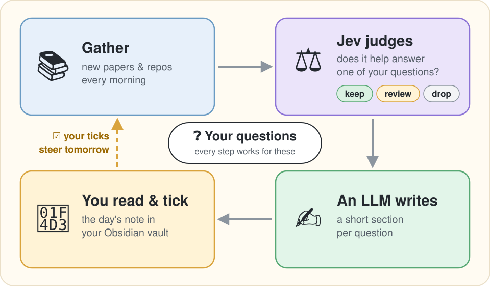

# jev-research-pipeline

**English** | [日本語](README.ja.md)

**A daily research monitor for your open questions: code owns the loop, Jev (a judgment-only model) judges, an LLM you choose writes.**

[](LICENSE)
[](pyproject.toml)
[](docs/pilot-log.md)

<p align="center">
  
</p>

jev-research-pipeline is a single-user pipeline for keeping up with research. You keep a few open
questions for each research topic. Every morning it checks new papers and repositories against those
questions and writes one note per topic into your Obsidian vault, with a section for each question
that moved. Plain Python code runs the loop the same way every time. Jev, a judgment model from the
API company TypeSafe, never writes text: it answers questions that have a fixed set of answers (yes or
no, a score, one pick from a list) with probabilities, and here it decides whether each source helps
answer a question. A general-purpose LLM writes only the prose: by default GPT-5.6 Sol through a
ChatGPT/Codex subscription, or Qwen on Alibaba Cloud's DashScope, switched with one environment
variable ([The writing model](#the-writing-model)). You close the loop by ticking checkboxes in the
note, and the ticks steer the next run.

It is a pilot, in daily use by its author. It needs Python 3.12, a paid TypeSafe API key for Jev,
and for the prose either a ChatGPT plan that includes Codex (the default) or a DashScope API key. It
is scheduled with macOS launchd (a manual run works anywhere Python 3.12 runs), and is MIT licensed. Notes are written in Japanese today: the prose instruction and the section
headings are Japanese strings in the source, and there is no language switch yet.

I built it because my previous setup, [daily-research](https://github.com/shimo4228/daily-research),
let an Opus agent with web search run the whole loop through `claude -p`, Claude Code's
non-interactive mode. It reported $8 to $15 of usage a day for three or four topics, and the agent
kept returning to the same theme: 88 of its 238 past topics (37%) landed on one. Here every judgment
is a cheap question with a fixed set of answers, code can check each one, and no model decides where
to look. A morning over four topics cost $1 to $2 by the notes' own cost lines while Qwen wrote the
prose on pay-per-token pricing (see [Status](#status-as-of-2026-09-25)); on the default subscription the
prose adds no per-token cost.
The full story is in the article
[Moving My Research Pipeline's Judgment Calls from an LLM to Jev, a Judgment-Only Model](https://dev.to/shimo4228/moving-my-research-pipelines-judgment-calls-from-an-llm-to-jev-a-judgment-only-model-4ncj)
([Japanese](https://zenn.dev/shimo4228/articles/jev-research-judgment-offload)). Other experiments
with Jev, and the projects this pipeline watches, are under [More from the author](#more-from-the-author).

## How a morning run works

Each research topic is a *line*: one long-running topic with its own vocabulary. Each morning:

1. Harvest your ticks from the line's earlier notes.
2. Pick the next three lines in rotation, plus any line marked daily.
3. For each open question, fetch candidates from five fixed discovery channels, the
   [source nets](#source-nets).
4. Jev screens each (source, question) pair: a cheap on-topic check first, then hard gates as yes/no
   questions and weighted scores. Code applies the thresholds and routes the pair to Keep, Review
   (borderline), Drop, Incomplete (the source had no abstract to judge) or Unjudged (the Jev request
   failed).
5. Kept sources are cut into verbatim sentences, and Jev picks out the sentences that advance or
   contradict the question. A claim is a sentence, never a paraphrase, so citations always resolve.
6. The writing model (GPT-5.6 Sol by default) writes one short section per question that got new
   evidence today, from those claims and short excerpts of their sources, with one paragraph marked
   as inference. It checks its own draft once. Jev then scores the section on a rubric and checks each evidence paragraph against its
   claims; a failing draft is rewritten once, then falls back to a template.
7. The note is written to the vault with an operations block: Jev question count, tokens, cost,
   per-net acceptance, and canary results (whether the papers a question must always keep were kept).

Your ticks are the labels. They seed the recommendation net (papers related to the ones you ticked),
feed the threshold proposals that `jrp fit` writes for you to apply, and become evaluation cases.
Every Jev call goes through Pydantic AI's native `typesafe:` model, so each judgment is a Pydantic
output type and the raw probability distributions are stored with the decision.

## Status as of 2026-09-25

- **The evaluation: 11 runs, ended 2026-09-23.** The last run passed 5 of its 7 goal conditions:
  every note under 12 KB with a short Review list; prose for every question that had evidence;
  off-topic papers dropped and every canary kept (a canary is a paper or repo a question must always
  keep; see [Questions are the unit](#questions-are-the-unit)); no failed fetch from any source API in
  that run; no stack traces. The time-and-cost condition failed on time alone: 601 s against a 600 s
  cap (cost was $0.297 against $0.30). And an independent judge, a separate Opus model reading only the
  finished notes against a seven-axis rubric, rated 1 of 3 notes publishable. The record, run by run,
  is in [docs/pilot-log.md](docs/pilot-log.md).
- **The prose step was rebuilt after the evaluation**; what changed and why is under
  [Why judgment, not generation](#why-judgment-not-generation). On frozen inputs from past runs, I read
  all six test cases as readable, and a fidelity check (a separate model comparing each draft with its
  sources) passed five of them ([docs/design/pipeline-design.md](docs/design/pipeline-design.md)).
- **Daily since 2026-09-24.** launchd runs it every morning against the real vault, over my seven
  active lines. With the new prose step a four-line morning costs more than the final evaluation run
  (also four lines, $0.297): $1.05 and $1.75 on the first two days with Qwen writing, and it takes
  about 15 minutes. The independent Opus judge has not read these notes yet. On both daily
  runs so far, arXiv keyword search answered HTTP 406, so `arxiv:` query lines returned nothing (new
  arXiv listings still arrive through the firehose net), and some OpenAlex citation lookups failed.
  The OpenAlex failure is fixed as of 2026-09-25; after a 406 that outlasts its retries, a run now
  stops arXiv keyword search for the day instead of paying the retries on every line.
- **The prose model is now GPT-5.6 Sol on a Codex subscription** (2026-09-24), in place of
  qwen3.7-max on DashScope. The prompt was tuned and read on qwen3.7-max and has not been re-read on
  GPT-5.6 Sol yet. Qwen is still one environment variable away
  (`JRP_PROSE_MODEL=dashscope:qwen3.7-max`), and with the subscription the notes' cost line counts
  Jev alone.
- **Thresholds.** Jev's routing thresholds started from the values in TypeSafe's published examples
  and were adjusted by hand during the evaluation. They have not been refit on ticks yet, so expect
  borderline calls. Those land in each note's Review section, and your ticks there are what a refit
  learns from.

## Quick start

- Python 3.12 and [uv](https://docs.astral.sh/uv/).
- A TypeSafe API key ([docs.typesafe.ai](https://docs.typesafe.ai)).
- For the prose, one of: a ChatGPT plan that includes Codex (the default; sign in once with
  `uv run jrp codex login`), or a DashScope API key (Alibaba Cloud Model Studio) for Qwen. See
  [The writing model](#the-writing-model).
- One file, `~/.config/jrp/env`, holding the environment variables a run needs (paths and keys); research lines
  and net budgets live in `config.toml`, questions in the repo's `questions/` directory.
  `scripts/launchd-jrp.sh` sources the env file before a scheduled run; for a manual run:
  `set -a; source ~/.config/jrp/env; set +a`.

A minimal `~/.config/jrp/env`:

```bash
export JRP_VAULT_DIR="/path/to/your/obsidian/vault"     # notes go to <vault>/daily-research/
export JRP_STORE_DIR="/path/to/store"                   # pipeline state, one JSON-LD file per line
export TYPESAFE_API_KEY="..."
export JRP_COST_CAP_USD="0.50"                          # per line per run
export JRP_DAILY_RESEARCH_CONFIG="/path/to/config.toml" # your research lines
```

`config.toml` names the lines. Each line is a `[tracks.<slug>]` table ("track" and "line" mean the
same thing). Lines were designed around research repositories: a line enters the rotation only if it points at
one with a `[[tracks.<slug>.repos]]` entry and its `target_repo`, and the only file read from that
repository is its `graph.jsonld`. If there is one, the names of its `Concept` and `DefinedTerm` nodes (schema.org types) become
the line's vocabulary, which Jev's screening and the prose use; otherwise the line's name is the only
vocabulary. A topic with no repository can run as a `daily = true` line, which runs every morning
beside the rotation.

```toml
[general]
lines_per_day = 3

[tracks.akc]
name = "Agent Knowledge Cycle"
[[tracks.akc.repos]]
target_repo = "~/projects/agent-knowledge-cycle"   # required for rotation; only graph.jsonld is read

[tracks.jev]
name = "TypeSafe Jev"
daily = true                                       # every morning, beside the rotated lines
```

Write at least one open question per line (next section), then:

```bash
uv sync
uv run jrp codex login        # once: sign in to ChatGPT in the browser for the default prose model
uv run jrp run                # harvest ticks, run the next lines, write notes
```

A line with no open question is skipped and reported as such. Once ticks exist, `jrp fit` proposes
refit thresholds (it writes a proposal file and never applies it), and `jrp export-cases` turns ticked
claims into pydantic-evals cases. `uv run jrp --help` lists the maintenance commands. Every variable
and the full `config.toml` are in [docs/configuration.md](docs/configuration.md).

## Questions are the unit

One file per line at `questions/<slug>.md` in the repository (or wherever `JRP_QUESTIONS_DIR`
points). The questions set the ceiling on what a run can find. An abridged example, translated from the
real `questions/jev.md` (which is in Japanese):

```markdown
<!-- jrp:questions:jev -->

## Where does Jev fail: broken calibration, judgments handed back to an LLM, expressiveness lost in framework integrations?
- slug: jev-failure-modes
- version: 1
- status: open
- opened: 2026-09-23
- retire: answered once TypeSafe publishes failure conditions per version and third parties reproduce them
- brief: when the probabilities break (out of distribution, questions with no answer, question types); cases that moved a judgment from an LLM to Jev and then moved it back; what integrations such as pydantic-ai lose
- method: reproduction experiments in public repos (calibration, ECE, agreement)
- evidence: numbers, or code that reproduces the failure
- not: posts that only share impressions of using Jev
- canary: https://github.com/scienthoon/jev-ood-calibration
- arxiv: jev system one
- github: jev calibration
- hf: judge model calibration
- web: TypeSafe Jev calibration failure
```

The parser reads every field. `slug` and `version` identify the question: change the wording, bump
the version, or old judgments count as judgments of the new wording. `status` gates the run (`open` /
`answered` / `dropped`). `brief`, `method` and `evidence` go into the state Jev sees for every
(source, question) pair. `not:` lines feed the hard gates with adjacent topics that would otherwise
pass every day. Two fields are for you rather than for Jev: `opened` is the date you opened the
question, and `retire:` is the rule you set in advance for closing it.

`canary:` lines name papers or repos this question must always keep. If no net brings one on a given
day it is fetched by its URL and screened anyway, and a dropped canary shows up in the note's
operations block as a sign that screening drifted.

`arxiv:`, `github:`, `hf:` and `web:` lines are the keyword net's search queries for this question,
one per line, in English except that a `web:` query may be in Japanese. You write them together with
the question, or have an assistant draft them in your session, and try them before a run uses them:
`uv run jrp queries check --line <slug>` sends each query once and prints the hit count and the newest
titles, storing nothing. arXiv matches every word (`all:w1 AND all:w2`), so keep its queries to two
to four words. A question without query lines sends no keyword query (the note's operations block
says so); the other nets still run for it. The authoring procedure is in [AGENTS.md](AGENTS.md)
(in Japanese, written for coding agents).

A run never edits this file. Questions and their queries change only when you change them.

## What a note looks like

Headings and prose are Japanese; the layout is:

```
# <line> — <date>
### <question>                 one section per question that got new evidence today
今日の変化                      prose; [n] cites a claim; the paragraph marked 推論 is inference
証拠                            today's sources for this question
反証                            claims that count against the answer, if any
- [ ] 読む価値があった            one checkbox per question-day; a tick propagates to its claims
## Review                       borderline sources, at most 10, one checkbox each
## 橋渡し                         sources Jev judged to tie the question to something outside the line's vocabulary
> [!note]- Claims               folded list of every claim with its source and a checkbox
## 未判定                         pairs whose Jev request failed
## 運用                          the operations block
```

Ticks are read back on the next run: `[x]` means yes (worth reading, correct), `[-]` means no, and
`[ ]` means no label. Obsidian's click toggles `[x]`; type `[-]` by hand.

## Source nets

An agent left to choose its own searches converges (the 37% above). So code fixes which nets run, in
what order, and how many requests each may make. No model writes a query at run time: the keyword net
sends the queries written into the question file, and the recommendation and citation nets are seeded
by papers that Jev's screening kept. No model can add a net, skip one, or change the order.

| net | what it fetches | default budget (API requests per run) |
|---|---|---|
| firehose | new arXiv listings for fixed categories, plus Hugging Face daily papers; no query | 2 |
| recommendation | Semantic Scholar recommendations seeded by ticked and kept papers, with random negatives | 1 |
| citation | OpenAlex forward citations of papers already kept | 3 |
| keyword | each question's authored queries, sent to arXiv (one request), Hugging Face papers, GitHub and, with a key, Tavily web search | 10: the configured 12 minus a 20% share (2) set aside for exploration |
| exploration | neighbouring OpenAlex topics of the papers already kept; nothing until the store holds OpenAlex papers | 1, from the 2 set aside (the other goes unused) |

Every net works without source-API keys (Jev's TypeSafe key and the writing model's login or key are
always needed), with one exception inside the keyword net: the Tavily web-search source is skipped when `TAVILY_API_KEY` is
unset, and the note says so. Semantic Scholar, OpenAlex and GitHub have shared keyless quotas;
optional keys raise them. Budgets, the exploration share, arXiv categories and the OpenAlex daily
credit cap are set under `[nets]` in `config.toml`. The operations block reports acceptance per net
and the number of distinct OpenAlex topics among kept papers; a falling topic count is the
convergence alarm.

## The writing model

Only one step generates text: the per-question section. Which model writes it is one environment
variable, `JRP_PROSE_MODEL`, in the form `<backend>:<model>`:

| backend | example | what it needs | in the note's cost line |
|---|---|---|---|
| `openai-codex` (default) | `openai-codex:gpt-5.6-sol` | a ChatGPT plan that includes Codex, and `uv run jrp codex login` once | nothing per token; use counts against the plan's limits |
| `dashscope` | `dashscope:qwen3.7-max` | `DASHSCOPE_API_KEY` (Alibaba Cloud Model Studio, international endpoint) | per token; a model with no price on record is flagged |

Both backends go through Pydantic AI (`OpenAICodexProvider`, `AlibabaProvider`), so any model either
one serves can be named, and adding another backend is one branch in
`src/jev_research_pipeline/generation/client.py`. `JRP_PROSE_THINKING` (`always` / `rewrite` / `off`)
maps to each backend's own switch: DashScope's thinking flag, or GPT-5.6's reasoning effort.

`jrp codex login` opens the same ChatGPT sign-in the Codex CLI uses and keeps the result in
`~/.config/jrp/codex-auth.json` (owner-only; `JRP_CODEX_AUTH` moves it). Run it on the machine that
runs launchd, because the browser redirects to `localhost:1455`. It is a login of the pipeline's own,
separate from the Codex CLI's `~/.codex/auth.json`: refresh tokens are single-use, so sharing one
with the CLI would leave one of them holding a dead grant after the first refresh. Every refresh is
written back to the file, so the next scheduled run starts from a live one. If the operations
block shows the prose drafts failing with `CredentialsRefreshError`, the grant was rejected: sign in
again. How you use your subscription this way is governed by your agreement with OpenAI.

The prose prompt was tuned and read on `dashscope:qwen3.7-max`. The prose bench (AGENTS.md) takes
`--model` in the same `<backend>:<model>` form, so both models can be compared on the same frozen
inputs.

## Why judgment, not generation

The design bet is that most of what an agent loop does with an LLM is judgment, and judgment can be
asked of a model that returns calibrated probabilities for a fixed set of answers. Three findings
from the evaluation shaped the current form:

- Without a question as the anchor, Jev's relevance judgments passed almost anything that shared a
  term with the line: a line about meditation and non-self filled up with claims about transformer
  attention. Anchoring every judgment on a (source, question) pair fixed this.
- A run before screening was staged asked Jev 20,573 questions for one line and produced a 283 KB
  note. Screening each source against the question first (a cheap on-topic check, then the full
  screen), and cutting claims only from kept sources, brings a line to roughly 900 to 1,900 questions
  and a note under 12 KB.
- Prose is the hard part. The independent judge never rated more than 1 of 3 notes publishable
  during the evaluation, and the usual failure was a paper's claim bent to fit the wording of the
  question. So the prose step was rebuilt: a new prompt and the model qwen3.7-max, short source
  excerpts beside the verbatim claims, a self-check pass, and Jev's check of each evidence paragraph
  against its claims before the note is written. The checks do not depend on which model writes;
  the default writer has since moved to GPT-5.6 Sol.

The design record, including every decision and the external evidence it rests on, is
[docs/design/pipeline-design.md](docs/design/pipeline-design.md).

## Observability, scheduling, development

Traces are OpenTelemetry. With `OTEL_EXPORTER_OTLP_ENDPOINT` unset the SDK is never initialised and
every span is a no-op. Scheduled runs send no traces: set the endpoint only on the command line of a
run you are debugging. A Docker-free local viewer, that command line and the span names are in
[docs/observability.md](docs/observability.md).

Two launchd plists live in [launchd/](launchd/README.md): `jrp run` every day at 05:00 and
`jrp drift` (a live replay that reports whether Jev's probabilities have shifted) on Mondays at 05:30.
Edit the absolute paths for your machine before loading them. If your vault is in iCloud Drive, the
wrapper copies the notes through `<JRP_STORE_DIR>/vault-stage/`, because macOS lets launchd's bash
open iCloud files but not the uv-managed Python.

```bash
.claude/verify.sh     # format, lint, types, bandit, deptry, tests; offline, no keys
uv run pytest -q      # replays committed cassettes; live recording is opt-in (docs/configuration.md)
```

## Related

- [TypeSafe Jev](https://docs.typesafe.ai) and the [Pydantic AI `typesafe:` model](https://pydantic.dev/docs/ai/models/typesafe/)
- [Pydantic AI's OpenAI Codex provider](https://github.com/pydantic/pydantic-ai/blob/main/docs/models/openai-codex.md) (ChatGPT/Codex subscription)
- [Qwen on DashScope](https://www.alibabacloud.com/help/en/model-studio/models)

## More from the author

Each of my experiments with Jev is written up as an article, in English on Dev.to and in Japanese on
Zenn:

- [How Close to Opus Does Jev, a Model That Writes No Text, Get at Skill Selection in 0.3 Seconds?](https://dev.to/shimo4228/how-close-to-opus-does-jev-a-model-that-writes-no-text-get-at-skill-selection-in-03-seconds-1nfj)
  ([Japanese](https://zenn.dev/shimo4228/articles/jev-vs-opus-skill-selection)). Jev and Claude Opus
  pick skills for the same 150 situations. Jev agrees with Opus about half as often as Opus agrees
  with itself, at about 1/560th of the cost.
- [What Does It Take to Reproduce Jev's Decisions Locally?](https://dev.to/shimo4228/what-does-it-take-to-reproduce-jevs-decisions-locally-3i0n)
  ([Japanese](https://zenn.dev/shimo4228/articles/local-decision-model-conditions)). Four local
  models replay the same 150 selections, and all four fail, each for a different reason.
- [I Added Jev's Skill Router to Claude Code and Turned Back Just Before Rewriting the Skill Listing](https://dev.to/shimo4228/i-added-jevs-skill-router-to-claude-code-and-turned-back-just-before-rewriting-the-skill-listing-34in)
  ([Japanese](https://zenn.dev/shimo4228/articles/jev-retrofit-limits)), with its code,
  [jev-skill-router](https://github.com/shimo4228/jev-skill-router). A Claude Code hook that asks Jev
  which installed skill fits each prompt. Running it showed it is unlikely to help a strong model.

The lines this pipeline watches are my own long-running projects. Among them:
[Agent Knowledge Cycle](https://github.com/shimo4228/agent-knowledge-cycle), a loop for keeping an
agent aligned with its operator as both change;
[Agent Attribution Practice](https://github.com/shimo4228/agent-attribution-practice), decision
records on who is accountable when an agent fails; and
[Authorship Strategy](https://github.com/shimo4228/authorship-strategy), on how an author stays
visible when readers meet ideas through LLMs. All of them, and new experiments as they appear, start
at [github.com/shimo4228](https://github.com/shimo4228). All articles: [Dev.to](https://dev.to/shimo4228)
(English) and [Zenn](https://zenn.dev/shimo4228) (Japanese).
